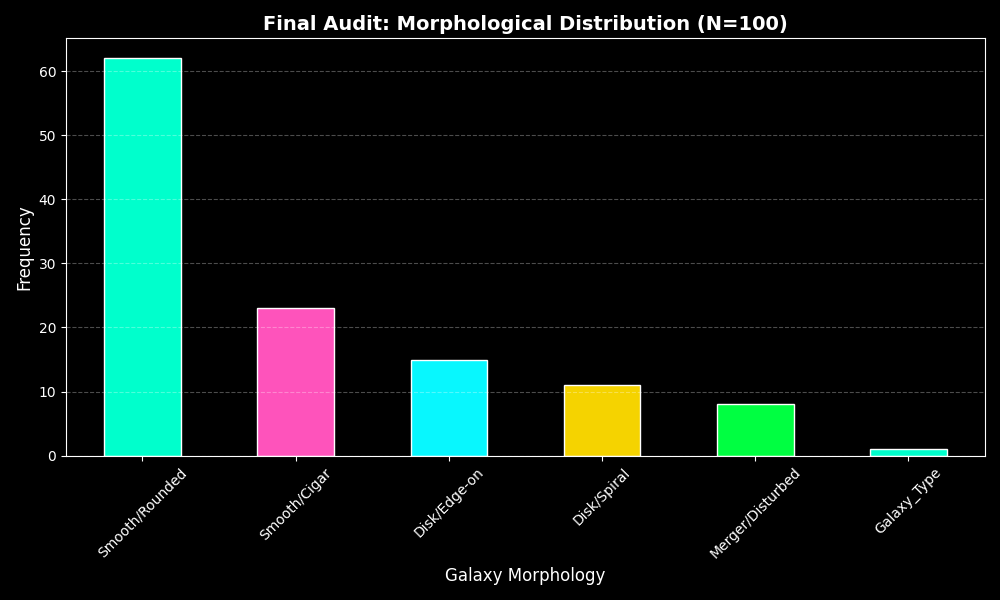

# 🌌 Zooniverse Data Research: Galaxy Morphological Analysis

## 🔬 Project Overview
This repository documents my independent technical research contribution to the **Galaxy Zoo** project. By combining manual morphological classification with Python-based data extraction, I am analyzing the distribution of galactic structures to support large-scale astrophysical datasets.

## 🛠️ Tech Stack & Methodology
- **Data Source:** Zooniverse / Sloan Digital Sky Survey (SDSS)
- **Languages:** Python (Pandas, Matplotlib)
- **API Integration:** `panoptes-client` for real-time project metadata and subject set auditing.
- **Goal:** To identify correlations between galactic "merger" events and anomalous data points.

## 📊 Research Status & Findings
- **Current Progress:** 104 Classifications Completed
- **Audit Baseline:** N=100 (Verified via `classification_audit_100.csv`)
- **Visual Analytics:** Generated via the automated framework in `Galaxy_Zoo_Analysis.ipynb`.

### 🧠 Scientific Interpretation & Analysis
> This data audit reveals a prevalence of **Smooth/Rounded** morphological categories. From a Data Integrity perspective, I am utilizing this baseline to refine **Anomaly Detection** algorithms, ensuring that rare 'Merger' or 'Disturbed' galaxies are not filtered out as noise during large-scale automated processing.

## 💻 Technical Implementation
To maintain high data fidelity, the analysis pipeline follows these steps:
1. **API Connection:** Authenticating with the Panoptes API to pull live subject set metadata.
2. **Data Sanitization:** Cleaning manual classification logs into structured CSV format.
3. **Statistical Modeling:** Using Matplotlib to visualize the morphological spread for peer-review readiness.
