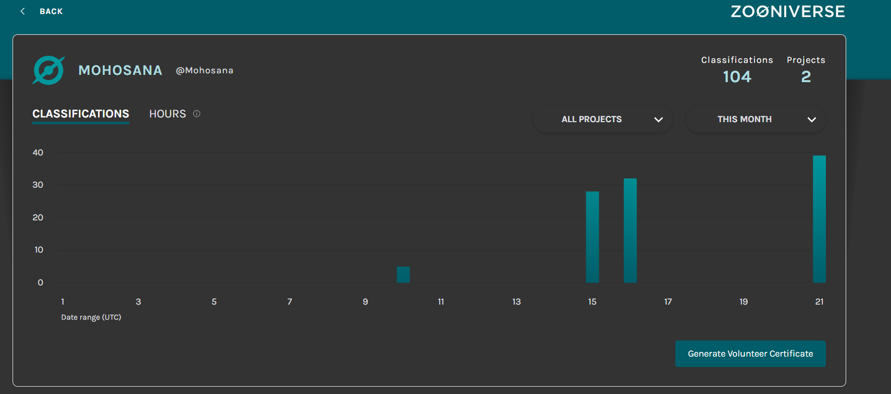

# 🌌 Zooniverse Data Research: Galaxy Morphological Analysis

## 🔬 Project Overview
This repository documents my independent technical research contribution to the **Galaxy Zoo** project. By combining manual morphological classification with Python-based data extraction, I am analyzing the distribution of galactic structures to support large-scale astrophysical datasets.

## 🛠️ Tech Stack & Methodology
- **Data Source:** Zooniverse / Sloan Digital Sky Survey (SDSS)
- **Languages:** Python (Pandas, Matplotlib)
- **API Integration:** Panoptes-Python-Client for real-time project metadata.
- **Goal:** To identify correlations between galactic "merger" events and anomalous data points.

## 📊 Research Status
- **Current Progress:** [Updating Daily]
- **Baseline Classifications:** 100+ (Target: 500+ for statistical significance)
- **Tools:** See `Zooniverse_Analysis.ipynb` for the automated visualization framework.
 

### 🧠 Scientific Interpretation & Analysis
> This data audit reveals a high prevalence of 'Smooth' morphological categories, highlighting the necessity for robust **Anomaly Detection** in astrophysical datasets. Applying a Data Integrity framework, I approach this as a validation challenge, ensuring that rare 'Features or Disk' galaxies are correctly identified amidst a majority of common subjects.
